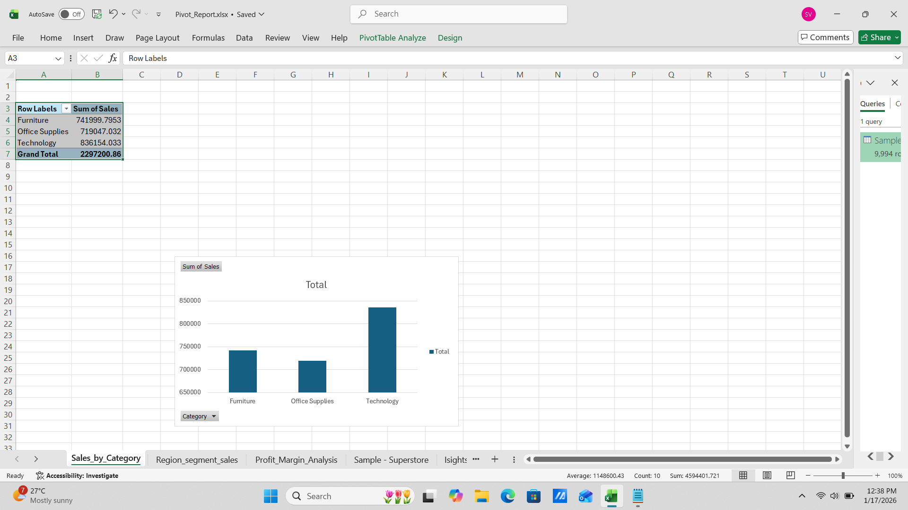
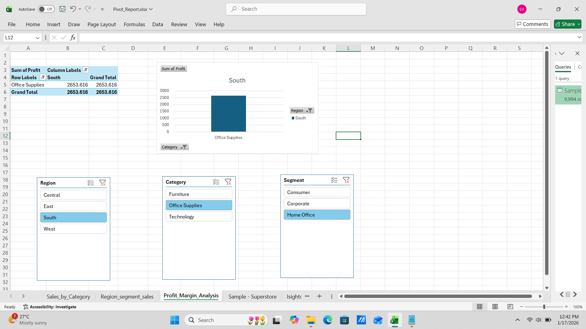

# Excel Pivot Analysis – Superstore Dataset

## Objective
To analyze Superstore sales data using Pivot Tables, Pivot Charts, Slicers and derive business insights.

## Tools Used
- Excel for Web
- Pivot Tables
- Pivot Charts
- Conditional Formatting
- Slicers

## Analysis Performed
- Sales by Category
- Sales by Region and Segment
- Profit Margin by Category and Region
- Interactive Dashboard with Slicers

## Files in Repository
- sample-superstore.csv
- Pivot_Report.xlsx
- Pivot_Report.pdf
- Insights.txt

## Key Learnings
- Data aggregation using Pivot Tables
- Business performance comparison
- Analytical storytelling
## Dashboard Preview

### Sales by Category

### Region vs Segment

### Profit Margin Analysis

